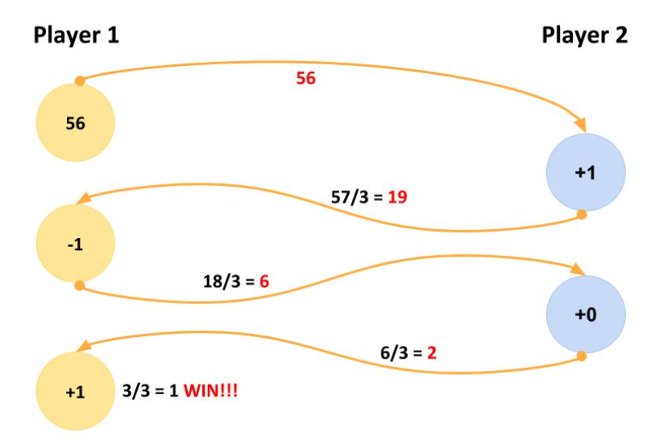

---

The Goal is to implement a game with two independent units – the players – communicating with each other using an API.

---

## Game Rules


When a player starts, it incepts a random (whole) number and sends it to the second player as an approach of starting the game.
The receiving player can now always choose between adding one of `{­1,0,1}` to get to a number that is divisible by `3`. Divide it by three. The resulting whole number is then sent back to the original sender.

The same rule applied until one player reaches the number 1 (after the division).
See example below.



For each "move", a sufficient output should get generated (mandatory: the added, and the resulting number).

Both players should be able to play automatically without user input. One of the players should optionally be adjustable by a user.

* Each player runs on its own (independent programs, two browsers, web‐workers, ...).
* Communication via an API (REST, Sockets, WebRTC, ...).
* A player may not be available when the other one starts.
* Try to be platform independent, in other words the project must be runnable easily in every environment.

---

## Currently Implemented Features

Apart from the game rules mentioned above, these are the features I've implemented.

* PWA
* Player Avatar
* Handle Third Player - Opens a New Room for additional players.

---

## Demo Videos

[Demo - Happy Day Flow](https://youtu.be/akrrmiVBQJg)

---

## [Light House Scores](https://thiruppathi.github.io/game-of-three/light-house-report.html)

[](https://thiruppathi.github.io/game-of-three/light-house-report.html#pwa)
[](https://thiruppathi.github.io/game-of-three/light-house-report.html#accessibility)
[](https://thiruppathi.github.io/game-of-three/light-house-report.html#best-practices)
[](https://thiruppathi.github.io/game-of-three/light-house-report.html#performance)
[](https://thiruppathi.github.io/game-of-three/light-house-report.html#seo)

---

## Installation & Pre-requisites

### Installation

```bash
npm install
```

### How to run the application

```bash
npm run dev
```

---

## Technology Stack

* **Front-End**
  * ES6+, CSS, HTML5, Web Sockets(Socket IO)
* **Back-End**
  * Node, ExpressJS, Web Sockets(Socket IO)
* **Task Runners, Build Process & Development Workflow**
  * NodeMon, Prettier
* **Source Control**
  * GitHub
* **IDE & Dev Tools**
  * VS Code
  * LightHouse
  * Chrome Dev Tools
* **Deployment & Hosting**
  * [Zeit-Now](https://zeit.co/now)
* **Icon Credits**
  * [Flaticon](https://www.flaticon.com/)

---

## Road Map

* Game Level (Easy, Medium, Hard) - Bigger Numbers based on Level
* Music - Game Audio
* Preference for Avatar/Name Selection
* Score Based on How fast a player resolves the number.

---
